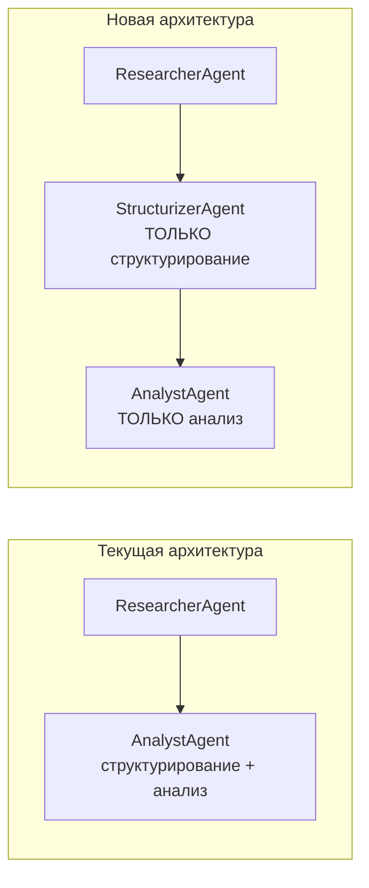
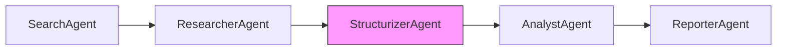
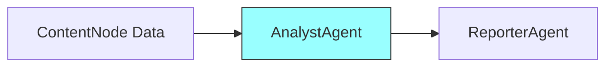
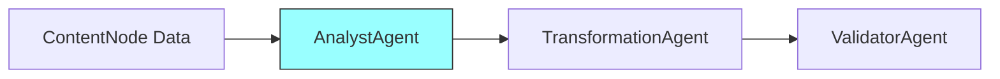
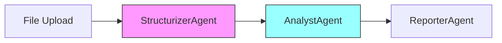

> **⚠️ УСТАРЕВШЕЕ** — StructurizerAgent реализован в V2. См. [`MULTI_AGENT_V2_CONCEPT.md`](./MULTI_AGENT_V2_CONCEPT.md) и `agents/structurizer.py`.

# StructurizerAgent: Разделение ответственности в Multi-Agent системе

**Дата создания**: 5 февраля 2026  
**Статус**: ✅ Реализовано в Multi-Agent V2  
**Автор**: GigaBoard Team

## Executive Summary

Предлагается разделить текущий **AnalystAgent** на два специализированных агента:

1. **StructurizerAgent** (новый) — извлечение структурированных данных из текста
2. **AnalystAgent** (изменённый) — анализ данных и формирование логических выводов

Это разделение следует принципу **Single Responsibility** и позволяет:
- Улучшить качество каждой операции за счёт специализации
- Независимо оптимизировать промпты для разных задач
- Создать более чёткую pipeline для обработки данных



---

## 1. Проблема текущей архитектуры

### 1.1 AnalystAgent совмещает две разные функции

**Функция 1: Структурирование** (RESEARCH MODE)
- Извлечение таблиц из HTML/текста
- Парсинг неструктурированных данных
- Создание JSON структур из raw text
- Требует: внимание к деталям, точность парсинга

**Функция 2: Анализ** (ANALYSIS MODE)
- Анализ существующих структурированных данных
- Формирование логических выводов
- Рекомендации по метрикам и визуализациям
- Требует: аналитическое мышление, domain knowledge

### 1.2 Проблемы совмещения

1. **Конфликт промптов**: System prompt пытается описать обе задачи, что размывает фокус
2. **Разные входные данные**: Структурирование получает текст, анализ — структурированные данные
3. **Разные выходные данные**: Структурирование → JSON таблицы, анализ → insights/рекомендации
4. **Сложность отладки**: Непонятно, проблема в парсинге или в анализе
5. **Невозможность параллельной оптимизации**: Улучшение одной функции может ухудшить другую

---

## 2. Предлагаемое решение

### 2.1 StructurizerAgent — новый агент

**Ответственность**: Извлечение структурированных данных из неструктурированного текста

**Входные данные**:
- Raw text (от ResearcherAgent)
- HTML content
- Unstructured documents
- Plain text с данными

**Выходные данные**:
```json
{
  "tables": [
    {
      "name": "extracted_data",
      "columns": [{"name": "col1", "type": "string"}, ...],
      "rows": [{"id": "uuid", "values": [...]}, ...]
    }
  ],
  "entities": [
    {"type": "company", "name": "Apple", "confidence": 0.95}
  ],
  "key_value_pairs": {
    "release_date": "2024-01-15",
    "price": 999
  },
  "extraction_confidence": 0.85,
  "structured_text": "Processed markdown text with structure"
}
```

**Когда вызывается**:
- После ResearcherAgent (веб-контент → структура)
- При импорте неструктурированных файлов
- При парсинге API ответов в свободном формате

### 2.2 AnalystAgent — изменённый агент

**Ответственность**: Анализ структурированных данных и формирование выводов

**Входные данные**:
- Структурированные таблицы (от StructurizerAgent или ContentNodes)
- JSON данные
- Существующие датасеты

**Выходные данные**:
```json
{
  "analysis_type": "exploratory|diagnostic|predictive|prescriptive",
  "insights": [
    {
      "finding": "Brand 'Apple' has highest revenue",
      "confidence": 0.92,
      "column_refs": ["brand", "salesAmount"],
      "metric": "sum(salesAmount)"
    }
  ],
  "recommendations": [
    {
      "action": "Create bar chart of top 10 brands by revenue",
      "columns": ["brand", "salesAmount"],
      "rationale": "Visual comparison of brand performance"
    }
  ],
  "suggested_transformations": [
    {
      "description": "Add profit margin column",
      "formula": "(price - cost) / price * 100",
      "required_columns": ["price", "cost"]
    }
  ],
  "data_quality_issues": [
    {"column": "date", "issue": "15% missing values"}
  ]
}
```

**Когда вызывается**:
- Discussion mode (анализ существующих данных)
- После StructurizerAgent (анализ извлечённых данных)
- Перед ReporterAgent (определение что визуализировать)
- Перед TransformationAgent (рекомендации по трансформации)

---

## 3. Новый Pipeline

### 3.1 Research Pipeline (поиск в интернете)



**Пример запроса**: "Топ-10 Rust фреймворков по GitHub stars"

| Шаг | Агент                 | Вход            | Выход                             |
| --- | --------------------- | --------------- | --------------------------------- |
| 1   | SearchAgent           | Query           | URLs + snippets                   |
| 2   | ResearcherAgent       | URLs            | Raw HTML → plain text             |
| 3   | **StructurizerAgent** | Plain text      | JSON таблица frameworks           |
| 4   | AnalystAgent          | JSON таблица    | Insights: "Tokio leads", rankings |
| 5   | ReporterAgent         | Insights + data | Bar chart widget                  |

### 3.2 Discussion Pipeline (анализ существующих данных)



**Пример запроса**: "Какие метрики можно посчитать из этих данных?"

| Шаг | Агент         | Вход                       | Выход                        |
| --- | ------------- | -------------------------- | ---------------------------- |
| 1   | AnalystAgent  | Схема таблиц + sample data | Recommendations + insights   |
| 2   | ReporterAgent | Recommendations            | Text widget с рекомендациями |

### 3.3 Transformation Pipeline



**Пример запроса**: "Добавь столбец с категорией цены"

| Шаг | Агент               | Вход               | Выход                                      |
| --- | ------------------- | ------------------ | ------------------------------------------ |
| 1   | AnalystAgent        | Схема + запрос     | Analysis: column types, suggested approach |
| 2   | TransformationAgent | Analysis + request | Python code                                |
| 3   | ValidatorAgent      | Code               | Validated code                             |

### 3.4 Hybrid Pipeline (импорт + анализ)



**Пример**: Загрузка неструктурированного отчёта

| Шаг | Агент             | Вход             | Выход                      |
| --- | ----------------- | ---------------- | -------------------------- |
| 1   | StructurizerAgent | Raw file content | Извлечённые таблицы        |
| 2   | AnalystAgent      | Таблицы          | Insights + recommendations |
| 3   | ReporterAgent     | Insights         | Dashboard widgets          |

---

## 4. Технический дизайн

### 4.1 System Prompts

#### StructurizerAgent System Prompt
```markdown
Вы — StructurizerAgent в системе GigaBoard. 
Ваша ЕДИНСТВЕННАЯ задача — извлечение структурированных данных из текста.

## ВАША РОЛЬ:
- Парсинг таблиц из HTML/text
- Извлечение именованных сущностей
- Определение типов данных
- Нормализация форматов

## ВЫ НЕ ДЕЛАЕТЕ:
- Анализ данных (это AnalystAgent)
- Выводы и рекомендации
- Визуализацию
- Трансформации

## ФОРМАТ ВЫВОДА:
{
  "tables": [...],
  "entities": [...],
  "key_value_pairs": {...},
  "extraction_confidence": 0.85
}
```

#### AnalystAgent System Prompt (обновлённый)
```markdown
Вы — AnalystAgent в системе GigaBoard.
Ваша задача — анализ структурированных данных и формирование выводов.

## ВАША РОЛЬ:
- Анализ существующих данных
- Формирование insights
- Рекомендации по метрикам и визуализациям
- Выявление паттернов и аномалий

## ВЫ НЕ ДЕЛАЕТЕ:
- Извлечение структуры из текста (это StructurizerAgent)
- Генерацию кода (это TransformationAgent)
- Визуализацию (это ReporterAgent)

## ВХОДНЫЕ ДАННЫЕ:
- Всегда структурированные (JSON таблицы, схемы)
- С типами колонок и sample data
- С metadata (row_count, column_count)

## ФОРМАТ ВЫВОДА:
{
  "insights": [...],
  "recommendations": [...],
  "data_quality_issues": [...]
}
```

### 4.2 PlannerAgent Updates

Добавить в system prompt PlannerAgent:

```markdown
## НОВЫЕ АГЕНТЫ:

8. **StructurizerAgent** — ТОЛЬКО для извлечения структуры из текста
   - Используется ПОСЛЕ ResearcherAgent
   - Используется для парсинга неструктурированных файлов
   - НЕ делает анализ!
   
9. **AnalystAgent** (обновлён) — ТОЛЬКО для анализа структурированных данных
   - Используется ПОСЛЕ StructurizerAgent (если был search)
   - Используется напрямую с ContentNode данными (если есть)
   - НЕ извлекает структуру из текста!

## ПАТТЕРН: Search → Research → Structure → Analyze → Report
1. SearchAgent → URLs
2. ResearcherAgent → Raw text
3. StructurizerAgent → JSON tables  ← НОВЫЙ ШАГ
4. AnalystAgent → Insights
5. ReporterAgent → Visualization
```

### 4.3 Engine Updates

```python
# В engine.py добавить инициализацию
self.agents["structurizer"] = StructurizerAgent(
    message_bus=self.message_bus,
    gigachat_service=gigachat
)

# Обогащение task для StructurizerAgent
if agent_name == "structurizer":
    # Передаём raw text от ResearcherAgent
    researcher_entry = self._last_result(context, "research")
    if researcher_entry:
        researcher_result = researcher_entry["payload"]
        task["raw_content"] = researcher_result.get("pages", [])
```

### 4.4 Файловая структура

```
apps/backend/app/services/multi_agent/agents/
├── structurizer.py   ← НОВЫЙ ФАЙЛ
├── analyst.py        ← ОБНОВЛЁННЫЙ
├── planner.py        ← ОБНОВЛЁННЫЙ
└── ...
```

---

## 5. Критерии валидации

### 5.1 StructurizerAgent

| Критерий         | Описание                   | Проверка                      |
| ---------------- | -------------------------- | ----------------------------- |
| Tables extracted | Есть хотя бы одна таблица  | `len(tables) > 0`             |
| Valid schema     | Колонки с именами и типами | `all(c has name, type)`       |
| Data present     | Есть строки данных         | `sum(row_counts) > 0`         |
| Confidence       | Уверенность > 0.5          | `extraction_confidence > 0.5` |

### 5.2 AnalystAgent

| Критерий          | Описание                   | Проверка                    |
| ----------------- | -------------------------- | --------------------------- |
| Insights present  | Есть insights              | `len(insights) > 0`         |
| Column references | Ссылки на реальные колонки | `all refs in input columns` |
| Recommendations   | Есть рекомендации          | `len(recommendations) > 0`  |
| Actionable        | Рекомендации actionable    | `all have action field`     |

---

## 6. План реализации

### Phase 1: Создание StructurizerAgent (2-3 дня)

**Задачи**:
1. ✅ Создать `structurizer.py` с базовой структурой
2. ✅ Написать system prompt для структурирования
3. ✅ Реализовать парсинг output format
4. ✅ Добавить в engine.py инициализацию
5. ✅ Unit tests для базовых сценариев

**Deliverables**:
- `apps/backend/app/services/multi_agent/agents/structurizer.py`
- Tests in `tests/multi_agent/test_structurizer.py`

### Phase 2: Обновление AnalystAgent (1-2 дня)

**Задачи**:
1. ✅ Убрать структурирование из system prompt
2. ✅ Фокус на анализ и recommendations
3. ✅ Обновить output format
4. ✅ Обновить валидацию

**Deliverables**:
- Updated `analyst.py`
- Updated tests

### Phase 3: Интеграция в PlannerAgent (1-2 дня)

**Задачи**:
1. ✅ Добавить StructurizerAgent в список агентов
2. ✅ Обновить decision logic для выбора агентов
3. ✅ Обновить примеры планов
4. ✅ Тестирование pipeline

**Deliverables**:
- Updated `planner.py`
- Integration tests

### Phase 4: Engine и CriticAgent (1 день)

**Задачи**:
1. ✅ Добавить обогащение context для StructurizerAgent
2. ✅ Добавить критерии валидации в CriticAgent
3. ✅ Обновить логирование

**Deliverables**:
- Updated `engine.py`
- Updated `critic.py`

### Phase 5: Тестирование и документация (1-2 дня)

**Задачи**:
1. ✅ End-to-end тесты всех pipelines
2. ✅ Performance benchmarks
3. ✅ Обновление MULTI_AGENT_SYSTEM.md
4. ✅ Changelog

**Deliverables**:
- Full test coverage
- Updated documentation

---

## 7. Риски и митигация

| Риск                            | Вероятность | Влияние | Митигация                                |
| ------------------------------- | ----------- | ------- | ---------------------------------------- |
| Увеличение latency (доп. шаг)   | Средняя     | Средний | Параллелизация где возможно, кэширование |
| Потеря контекста между агентами | Низкая      | Высокий | Полная передача results между шагами     |
| Дублирование логики             | Средняя     | Низкий  | Чёткие границы ответственности           |
| Breaking changes                | Высокая     | Средний | Backward compatibility, feature flags    |

---

## 8. Метрики успеха

### Quality Metrics
- **Precision структурирования**: % корректно извлечённых таблиц → target: >90%
- **Recall структурирования**: % найденных таблиц из возможных → target: >85%
- **Relevance insights**: % actionable recommendations → target: >80%

### Performance Metrics
- **Latency increase**: Добавление шага → target: <5 секунд
- **Token usage**: Не должен значительно увеличиться → target: <15% increase

### User Metrics
- **Success rate**: % успешных research pipelines → baseline + 10%
- **User satisfaction**: Качество рекомендаций в discussion mode

---

## 9. Примеры использования

### Пример 1: Research Query

**Запрос**: "Топ-5 Python web фреймворков по GitHub stars"

**Search → Research → Structure → Analyze → Report**:

```
Step 1: SearchAgent
Input: "Python web frameworks GitHub stars"
Output: {urls: [github.com/rankings, ...], snippets: [...]}

Step 2: ResearcherAgent  
Input: urls from Step 1
Output: {pages: [{url: "...", content: "Django 71k stars, Flask 65k..."}]}

Step 3: StructurizerAgent  ← NEW
Input: pages content
Output: {
  tables: [{
    name: "frameworks",
    columns: [{name: "Framework", type: "string"}, {name: "Stars", type: "int"}],
    rows: [["Django", 71000], ["Flask", 65000], ...]
  }]
}

Step 4: AnalystAgent
Input: structured tables
Output: {
  insights: [
    {finding: "Django leads with 71k stars", confidence: 0.95}
  ],
  recommendations: [
    {action: "Bar chart comparison", columns: ["Framework", "Stars"]}
  ]
}

Step 5: ReporterAgent
Input: insights + tables
Output: {widget_type: "bar_chart", data: [...]}
```

### Пример 2: Discussion Mode

**Запрос**: "Какие метрики можно посчитать из этих данных?"
**Данные**: ContentNode с таблицей sales (price, quantity, brand)

**Analyze → Report**:

```
Step 1: AnalystAgent
Input: {tables: [{name: "sales", columns: ["price", "quantity", "brand"]}]}
Output: {
  insights: [
    {finding: "3 numeric/categorical columns available", confidence: 0.9}
  ],
  recommendations: [
    {action: "Calculate total revenue", formula: "price * quantity"},
    {action: "Group by brand", columns: ["brand"]},
    {action: "Price distribution histogram", columns: ["price"]}
  ]
}

Step 2: ReporterAgent
Input: recommendations
Output: {widget_type: "text", content: "Рекомендуемые метрики: ..."}
```

---

## 10. Changelog

### 2026-02-05 — Initial Concept

- ✅ Концепция разделения AnalystAgent
- ✅ Дизайн StructurizerAgent
- ✅ Pipeline diagrams
- ✅ План реализации
- ⏳ Ожидает review и approval

---

## Appendix A: API Reference

### StructurizerAgent API

```python
class StructurizerAgent(BaseAgent):
    """Извлечение структуры из неструктурированного текста."""
    
    async def process_task(
        self,
        task: Dict[str, Any],  # {description, raw_content}
        context: Optional[Dict[str, Any]] = None
    ) -> Dict[str, Any]:
        """
        Returns:
        {
            "status": "success",
            "tables": [...],
            "entities": [...],
            "key_value_pairs": {...},
            "extraction_confidence": float,
            "agent": "structurizer"
        }
        """
```

### AnalystAgent API (updated)

```python
class AnalystAgent(BaseAgent):
    """Анализ структурированных данных."""
    
    async def process_task(
        self,
        task: Dict[str, Any],  # {description, input_data}
        context: Optional[Dict[str, Any]] = None
    ) -> Dict[str, Any]:
        """
        Returns:
        {
            "status": "success",
            "insights": [...],
            "recommendations": [...],
            "data_quality_issues": [...],
            "analysis_confidence": float,
            "agent": "analyst"
        }
        """
```

---

## Appendix B: Migration Guide

### Для существующего кода

1. **PlannerAgent plans** — автоматически обновятся (паттерн detection)
2. **Direct AnalystAgent calls** — проверить, нужен ли StructurizerAgent перед
3. **Custom workflows** — добавить StructurizerAgent между Researcher и Analyst
4. **Tests** — обновить expected pipelines

### Feature Flag

```python
# config.py
ENABLE_STRUCTURIZER_AGENT = True  # False для rollback
```

```python
# engine.py
if settings.ENABLE_STRUCTURIZER_AGENT:
    self.agents["structurizer"] = StructurizerAgent(...)
```
