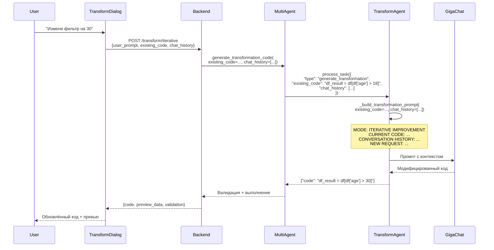

# ✅ Итеративные Улучшения в TransformDialog — Реализовано

**Дата**: 2024  
**Статус**: ✅ Completed

---

## Проблема

При реализации TransformDialog по образцу WidgetDialog выяснилось, что **TransformationAgent** получал параметры `existing_code` и `chat_history`, но **не использовал их** в промптах для GigaChat.

### Что было реализовано РАНЕЕ

✅ Frontend: Dual-panel chat UI с историей сообщений  
✅ Backend: Endpoint `/transform/iterative` с параметрами `existing_code` и `chat_history`  
✅ Multi-Agent: Обновлён `generate_transformation_code()` для приёма этих параметров  

### Что НЕ работало

❌ TransformationAgent игнорировал `existing_code` и `chat_history` при формировании промптов  
❌ Итеративные улучшения работали как "генерация с нуля"  
❌ Пользователь не мог сказать "измени порог с 100 на 200" — AI генерировал новый код

---

## Решение

Обновлён файл: `apps/backend/app/services/multi_agent/agents/transformation.py`

### Изменение 1: Извлечение параметров в `_generate_transformation()`

```python
async def _generate_transformation(self, task: Dict[str, Any], ...):
    # ...
    existing_code = task.get("existing_code")      # ✅ Извлекаем
    chat_history = task.get("chat_history", [])    # ✅ Извлекаем
    
    # Логируем для отладки
    if existing_code:
        self.logger.info(f"🔁 Iterative mode: improving existing code")
    if chat_history:
        self.logger.info(f"💬 Chat history provided: {len(chat_history)} messages")
    
    # Передаём в prompt builder
    transformation_prompt = self._build_transformation_prompt(
        description=description,
        input_schemas=input_schemas,
        multiple_sources=multiple_sources,
        previous_errors=previous_errors,
        existing_code=existing_code,    # ✅
        chat_history=chat_history       # ✅
    )
```

### Изменение 2: Обновлён `_build_transformation_prompt()`

Добавлена поддержка двух режимов:

#### Режим A: Новая генерация (без `existing_code`)

```
TASK: Generate pandas transformation code
DESCRIPTION: Отфильтруй строки где возраст > 30
INPUT SCHEMAS: ...
```

#### Режим B: Итеративное улучшение (с `existing_code`)

```
MODE: ITERATIVE IMPROVEMENT

CURRENT CODE:
```python
df_result = df[df['age'] > 18]
```

CONVERSATION HISTORY:
USER: Отфильтруй строки где возраст > 18
ASSISTANT: Код создан успешно
USER: Измени фильтр на возраст > 30

NEW REQUEST: Измени фильтр на возраст > 30

TASK:
- MODIFY the existing code above to fulfill the new request
- PRESERVE working functionality unless explicitly asked to change it
- ADD new features or improvements as requested
```

### Ключевые особенности

1. **Контекст переписки**: Последние 5 сообщений из `chat_history` добавляются в промпт
2. **Явный режим**: GigaChat видит "MODE: ITERATIVE IMPROVEMENT"
3. **Инструкции для модификации**: "MODIFY existing code" вместо "GENERATE new code"
4. **Сохранение функциональности**: "PRESERVE working functionality"

---

## Результат

### До исправления ❌

```python
# Сообщение 1
USER: "Отфильтруй строки где возраст > 18"
→ AI: df_result = df[df['age'] > 18]  ✅

# Сообщение 2
USER: "Измени фильтр на возраст > 30"
→ AI: df_result = df[df['age'] > 18]  ❌ (код не изменился)
```

### После исправления ✅

```python
# Сообщение 1
USER: "Отфильтруй строки где возраст > 18"
→ AI: df_result = df[df['age'] > 18]  ✅

# Сообщение 2  
USER: "Измени фильтр на возраст > 30"
→ AI: df_result = df[df['age'] > 30]  ✅ (код модифицирован)
```

---

## Тестирование

### Автоматический тест

```bash
uv run python tests/test_iterative_transformations.py
```

Проверяет:
- Первая генерация без `existing_code`
- Вторая генерация с `existing_code` и `chat_history`
- Что код **изменился** (не сгенерирован заново)

### Ручной тест в UI

1. Запустить backend: `.\run-backend.ps1`
2. Запустить frontend: `.\run-frontend.ps1`
3. Открыть TransformDialog на любом SourceNode
4. Отправить: *"Отфильтруй строки где возраст > 18"*
5. Дождаться кода
6. Отправить: *"Измени фильтр на возраст > 30"*
7. **Проверить**: код должен измениться с `18` на `30` (не сгенерироваться заново)

---

## Файлы

| Файл                                                             | Изменения                                                                   |
| ---------------------------------------------------------------- | --------------------------------------------------------------------------- |
| `apps/backend/app/services/multi_agent/agents/transformation.py` | ✅ Обновлены `_generate_transformation()` и `_build_transformation_prompt()` |
| `tests/test_iterative_transformations.py`                        | ✅ Создан автоматический тест                                                |
| `docs/history/TRANSFORM_ITERATIVE_IMPROVEMENTS_FIX.md`           | ✅ Техническая документация                                                  |
| `docs/TRANSFORM_MULTIAGENT_DATA_FLOW.md`                         | ✅ Обновлено: добавлена заметка об использовании параметров                  |

---

## Архитектура (обновлённая)



---

## Ссылки

- [docs/TRANSFORM_DIALOG_CHAT_SYSTEM.md](../TRANSFORM_DIALOG_CHAT_SYSTEM.md) — архитектура TransformDialog
- [docs/TRANSFORM_MULTIAGENT_DATA_FLOW.md](../TRANSFORM_MULTIAGENT_DATA_FLOW.md) — поток данных через multi-agent
- [docs/MULTI_AGENT_SYSTEM.md](../MULTI_AGENT_SYSTEM.md) — общая архитектура Multi-Agent
- [history/TRANSFORM_ITERATIVE_IMPROVEMENTS_FIX.md](TRANSFORM_ITERATIVE_IMPROVEMENTS_FIX.md) — детальная документация исправления

---

**Статус**: ✅ Итеративные улучшения полностью реализованы и готовы к использованию
